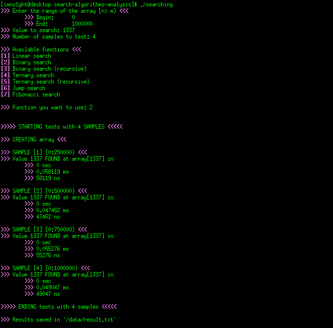
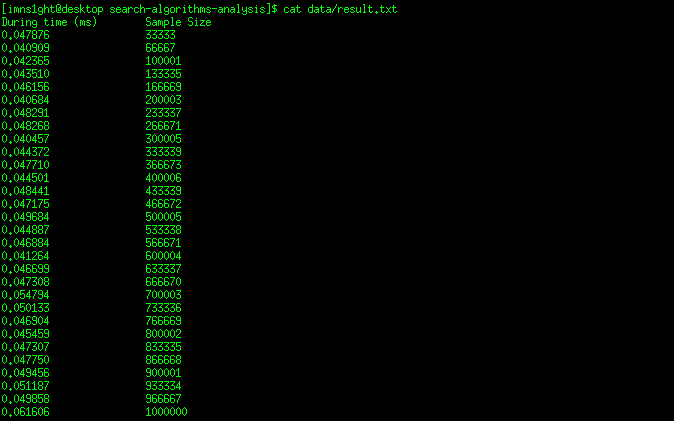

# Search Algorithms Analysis

The project is focused in compare the search algorithms [Linear search](https://en.wikipedia.org/wiki/Linear_search), [Binary search (iterative and recursive)](https://en.wikipedia.org/wiki/Binary_search_algorithm), [Ternary search (iterative and recursive)](https://en.wikipedia.org/wiki/Ternary_search), [Jump search](https://en.wikipedia.org/wiki/Jump_search) and [Fibonacci search](https://en.wikipedia.org/wiki/Fibonacci_search_technique) utilizing the empirical analysis technique to determine as input size affects the performance of search algorithms.

Interface



Output file



## Requiriments
* C++
* GCC/G++
* [Make](https://www.gnu.org/software/make/)

## Compiling
You can use the Makefile, just enter in your terminal:

```bash
make
```

## Usage
After compiling, enter:

```bash
./searching
```

Now, you'll need to enter the range of the array that you want to perform searches
```cpp
>>> Begin: 0
>>> End: 1000000
```

Put the value to search
```cpp
>>> Value to search: 1337
```

After that, we need to define the number of samples.

Assuming we want 50 samples of data, with begin = 0 and end = 1000000. We will have samples with interval of (1000000 − 0)/50 = 20000. So, the size of the samples will be like that 20000, 40000, 60000, ... , 980000, 1000000.

```cpp
>>> Number of samples: 50
```

Finally, we will enter the search function we want to use!

```cpp
>>> Available functions <<<
[1] Linear search
[2] Binary search
[3] Binary search recursive
[4] Ternary search
[5] Ternary search recursive
[6] Jump search
[7] Fibonacci search

>>> Function you want to use: 2
```

## Contributing
You are welcome! Create the pull requests. 

For major changes, please, open an issue first to discuss what you would like to change.

## Support
* Twitter: [@imns1ght](https://twitter.com/imns1ght) | E-mail: [jeffersonbrunoIT [at] gmail [dot] com](mailto:jeffersonbrunoit@gmail.com)
* E-mail [RanieriSantos [at] protonmail [dot] com](mailto:RanieriSantos@protonmail.com)

## Authors and acknowledgment
### Authors
* [Jefferson Bruno (imns1ght)](https://imns1ght.github.io)
* [Ranieri Santos](https://github.com/RanieriSantos)

### Acknowledgment
* [Professor Selan R. dos Santos](https://www.dimap.ufrn.br/~selan/)
* [GeeksforGeeks](https://www.geeksforgeeks.org/)

## Project status
Slow... The university is draining our energy. :P

## License
[MIT](https://choosealicense.com/licenses/mit/)